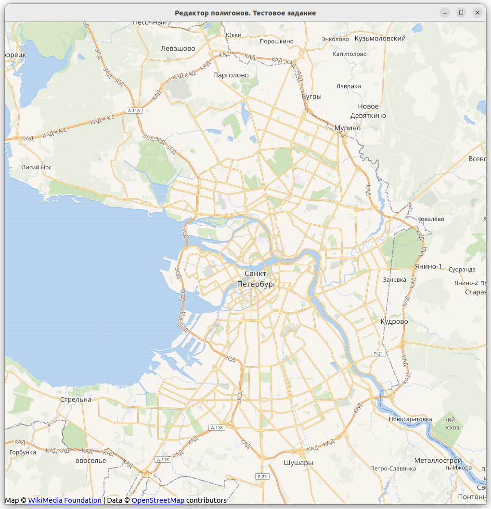
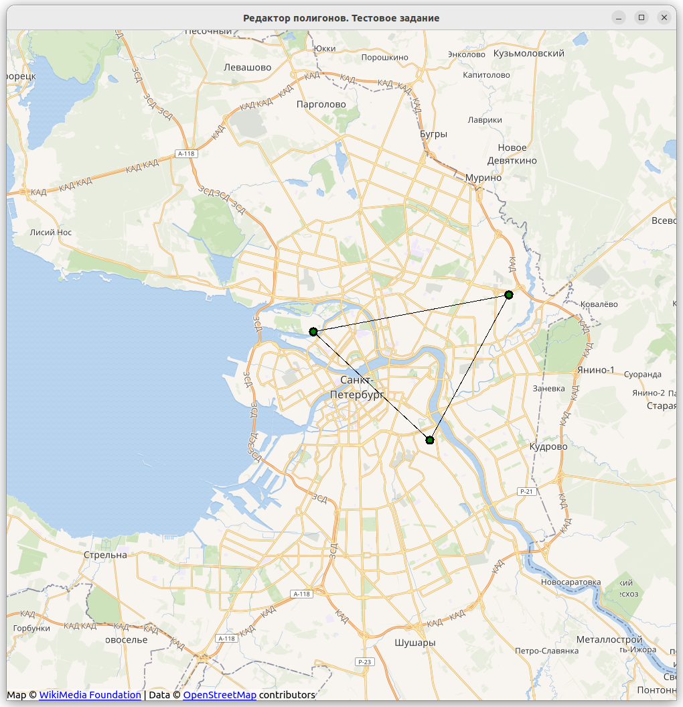
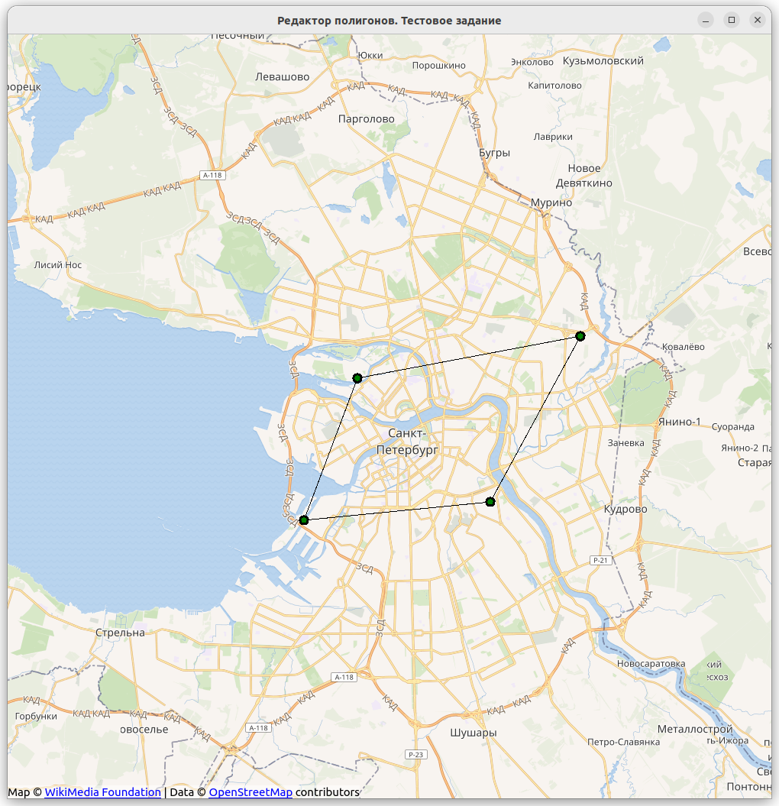
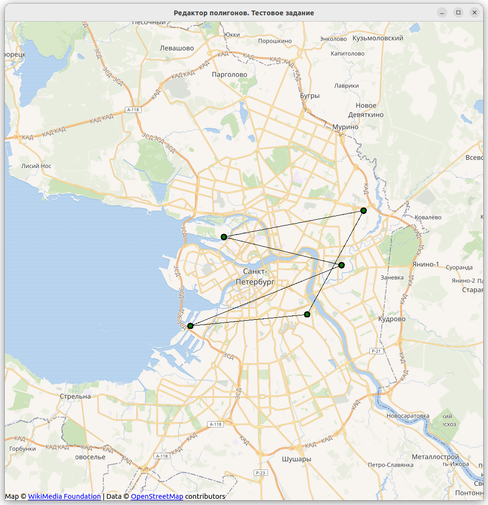

# TestWorkMaps
Тестовое задание для Radar MMS
====
Необходимо написать QML редактор полигонов на карте OpenStreetMap:
1. Полигон должен наноситься при помощи кликов левой кнопки мыши на карте, если курсор мыши находится у ребра полигона, то при левом клике мыши, точка вставляется на ребре соответствующем ребре полигона;
2. По правой кнопки мыши на точке - удаление;
3. При зажатии левой кнопки мыши на точке полигона, точку можно "перетаскивать" (drag and drop)

## Текущий статус
1. Функциональность добавления точек полигона
2. Функциональность добавления полигона
3. Функциональность удаления точек полигона
4. Поддержка drag and drop, без изменения полигона

## Демонстрация работы

Присутствует баг, не доделано

